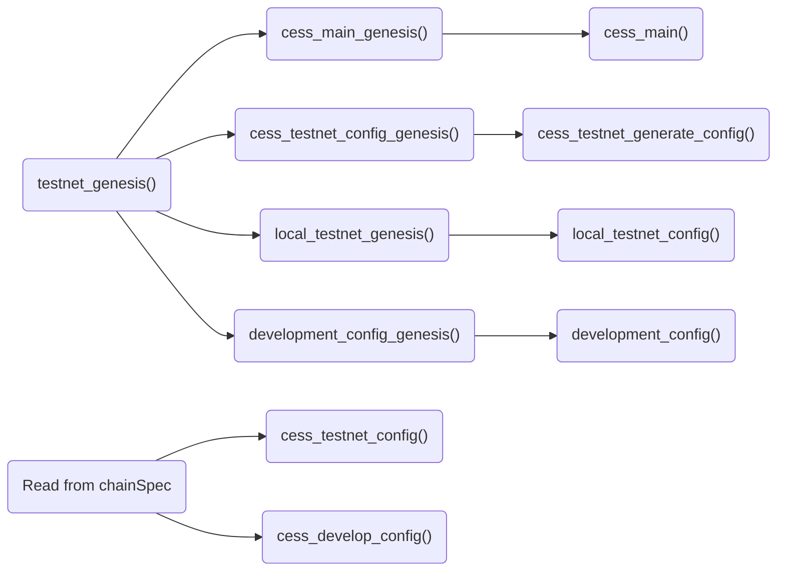

The relationship of how the functions related to each others, in diagram.

Refer to [mermaid doc: Flowchart](https://mermaid.js.org/syntax/flowchart.html) for syntax.

```mermaid
flowchart LR
  %% main
  testnet_genesis("testnet_genesis()") --> main_genesis("cess_main_genesis()") --> main("cess_main()")

  %% testnet
  testnet_genesis --> testnet_config_genesis("cess_testnet_config_genesis()") --> testnet_generate_config("cess_testnet_generate_config()")

  %% local testnet
  testnet_genesis --> local_testnet_genesis("local_testnet_genesis()") --> local_testnet_config("local_testnet_config()")

  %% development
  testnet_genesis --> development_config_genesis("development_config_genesis()") --> development_config("development_config()")

  %% Reading from chainspec file
  chainSpec("Read from chainSpec") --> testnet_config("cess_testnet_config()")
  chainSpec --> develop_config("cess_develop_config()")
```
