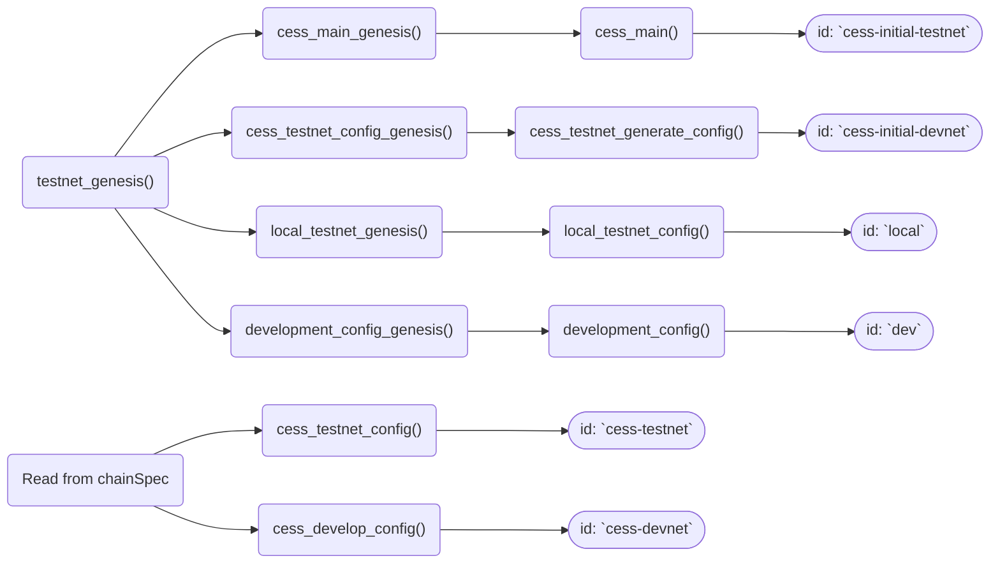

The relationship of how the functions related to each others, in diagram.

Refer to [mermaid doc: Flowchart](https://mermaid.js.org/syntax/flowchart.html) for syntax.

`id` below is the `id` parameter used in **Cli** [`load_spec()`](https://github.com/CESSProject/cess/blob/main/node/src/command.rs#L57-L69)

